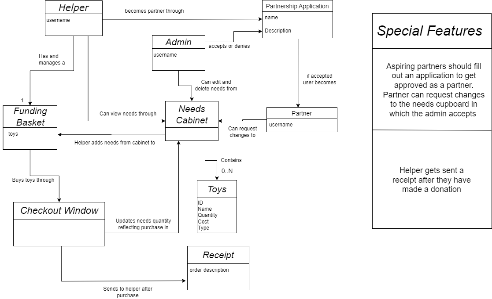
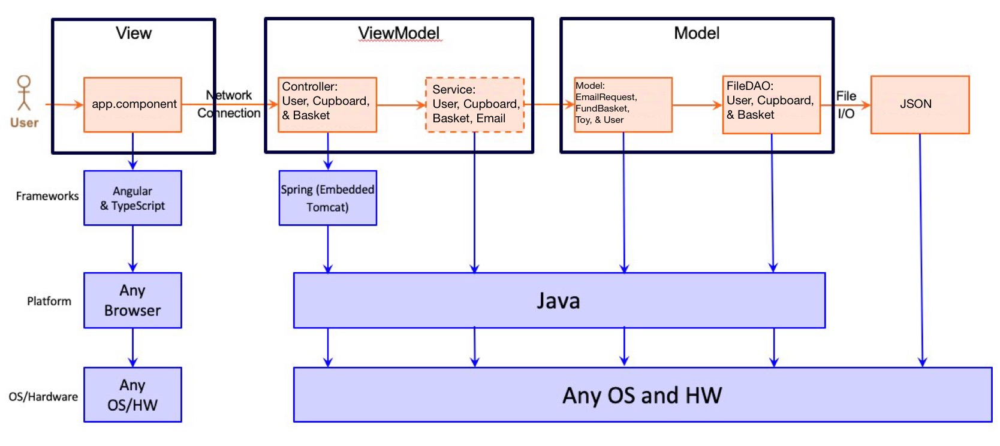

# PROJECT Design Documentation

## Team Information
* Team name: Se7en
* Team members
  - Connor Patterson
  - Nicholas Creeley
  - Matthew Tosi
  - Gavin McIlvaine
  - Kyle Krebs

## Executive Summary

This project centers around building a website for a non-profit organization -- Smiles Unlimited. They handle donating toys to after school programs, hospitals and daycares. Users log in with just a username, and Helpers can browse needs, add to their funding basket, and check out. U-fund Managers handle need management. Everything is saved to files so that changes persist. This project has exposed us to hands-on web dev with real-world tools, teaching us how to tackle challenges and learn on the fly.

### Purpose
The purpose of this project is to offer individuals seeking to contribute to non-profit organizations a user-friendly platform for making a difference. By creating an accessible website, our aim is to facilitate connections between those who want to help and the organizations in need. Through this platform, people can easily browse, select, and support various needs, enabling them to play an active role in supporting causes they care about.

### Glossary and Acronyms
> _**[Sprint 2 & 4]** Provide a table of terms and acronyms._

| Term     | Definition                            |
|----------|---------------------------------------|
| SPA      | Single Page                           |
| CUPBOARD | AKA toy DAO                           |
| DAO      | Data Access Object                    |
| MVP      | Minimum Viable Product                |
| API      | Application Programming Interface     |
| UI       | User Interface                        |

## Requirements

This section describes the features of the application.

### Definition of MVP

MVP Includes login authentication where a helper can login and access their basket to checkout and fund the needs. A Ufund manager can edit the needs data in the cupboard. all the data is saved in files that can be reaccessed. Some feature enhancements are required in the Smiles unlimited it is a receipt and partners feature.

### MVP Features
We had a number of MVP Stories and Epics. Within these epics there are numerous stories to complete each. Some are listed as well but not all.   

The epics included:

* User Interface: (create login screen, create toys screen)

* User Authentication: (create admin and user login)

* Needs Management: (create new needs, add new needs, update needs)

* Helper Functionality: (add need to basket, remove need from basket)

* Persistence: (everything stored in DAOs)

### Enhancements
Receipt: Our receipt feature allows helpers to recieve an email containing information about their specific donation. It allows people to keep track of what they donate. You are given the opportunity to type your email in the checkout window.

Partner Application: Our partner application feature allows helpers to go through an application process to become a "partner". If accepted, this gives that helper the ability to add needs to the needs cupboard.

## Application Domain

This section describes the application domain.

The application facilitates a charitable donation system where Helpers manage a basket of toys to donate. 

The needs cabinet acts as the "heart" of the domain. It holds toys that are requested by the charity. The admin is able to control this list of toys such as adding and removing. 

The helper also connects to the cabinet and takes toys from it and adds them to their own basket. This basket holds their specific toys they would like to donate. When ready to checkout, they are taken to window in which a reciept is stored and sent via email. 

The partner is a special kind of helper. The helper can request a "partner application". This application is then accepted/rejected by the admin. If accepted that user now becomes an elavated status of "Partner". Similar to admin, a partner can add toys to the cabinet. 

## Architecture and Design

This section describes the application architecture.

### Summary

The following Tiers/Layers model shows a high-level view of the webapp's architecture.  

The web application, is built using the Model–View–ViewModel (MVVM) architecture pattern. 

The Model stores the application data objects including any functionality to provide persistance. 

The View is the client-side SPA built with Angular utilizing HTML, CSS and TypeScript. The ViewModel provides RESTful APIs to the client (View) as well as any logic required to manipulate the data objects from the Model.

Both the ViewModel and Model are built using Java and Spring Framework. Details of the components within these tiers are supplied below.

### Overview of User Interface

Smiles Unlimited User Interface Flow

Our application starts with a login page prompting for a username. There are multiple options that are available from there. You can sign in as an admin or a helper. If you don't have an account made, then typing in a username that doesn't exist will automatically create a new account for you.

Helpers get routed to a page where they can see the list of needs and the quantity thats being requested for each toy. On this page there is an option to apply to be a partner in the upper left corner. They can also see the toys in their funding basket through a button on the top right corner. The page also contains the list of needs in the needs cupboard. Above that list is a search bar where they can search for specific toys. Clicking on a toy in the needs list routes them to a different page where they can edit the quantity they want to donate for that specific toy. They also have the option to add that toy to their basket. Once they've added the toys they want to donate to their basket, clicking on the funding basket button in the top right is where they will then be sent to the checkout window.

The checkout window not only shows the toys in your basket, but also prompts for a place to put your email in so you could receive a email summarizing all the toys you donated. Once you have your desired amount of toys in the basket and your email typed in. Clicking the check out button is what confirms your donation.

There is only one major change in the UI when you apply to be a partner and are accepted by the admin. You now have the ability to not only donate needs, but you can also add new needs to the cupboard on the website. You now have the same ability to add needs like an admin.

Admins get routed to a page where their UI is a little different from a helpers. It still contains a search bar and list of needs. However, admins have the ability to add needs through an option that's on the bottom of the page. It prompts you to fill out the required criteria for toys like name, quantity, cost, and type. They also don't have a funding basket button on the top right corner because admins cannot have a funding basket. Admins also can delete and update toys in the needs cupboard. Instead of having a button in the top left corner to apply to be a partner, admins have a button that allow them to see whos applied to be a partner. Its on this page where the admin can accept or reject the application.

Below are sequence diagrams showcasing our user interface: 

The View Tier of our application serves as the user's window into the system, built using Angular for a dynamic and responsive experience. It begins with the LoginComponent, which handles user login, setting the stage for secure and personalized user interactions.

Once logged in, the AppComponent serves as the core interface, orchestrating navigation with help from AppRoutingModule. It dynamically loads components like ToysComponent for browsing toys, and ToyDetailComponent for detailed views and potential edits, catering to different user roles.

The BasketComponent is vital for need donation, allowing helpers to review and manage their selections before checkout. For users looking to deepen their engagement, the PartnershipComponent and UserComponent offer paths to partnership opportunities and adding needs for other helpers to contribute to.

Overall, the View Tier is designed to provide a seamless navigation flow, from authentication to detailed interaction with the toy cupboard, ensuring a user-friendly and engaging platform.

### ViewModel Tier

The ViewModel Tier consists of controllers and services that respond to direct http requests from users that want to execute the cURL commands. Below is the list of Controllers and Services that we have implemented into our project. 

* CupboardController - Rest API Controller with commands for cURL functions

* CupboardService - Callable service by Controller to access the FileDAO in the model

* BasketController - Rest API  Controller with commands for cURL functions

* BasketService - Callable Service by controller to access the FileDAO in the model

* UserController - Rest API Controller with commands for cURL functions

* UserService - Callable service by Controller to access the FileDAO in the model

* EmailService - Callable service by the front end to send receipt directly to provided email.

**Heres an example UML for the basket contoller.**

### Model Tier

The model teir consists of File DAO's and class objects. This acts as the foundation of our application and makes sure that things run with persistance. Or in other words it stores all the data. Below are each of our files and a short description. There is also a UML of the toy class given.  

* CupBoardFileDAO - File Model to access the Persistence data

* Toy - lowest file persistence layer with direct access to JSON File(s) 

* FundBasket - the fundbasket class where all the toys they want to buy are stored

* BasketFileDAO- stores and maintains all baskets 

* User - the class representing a user, stores username for login

* UserDAO - the DAO that stores and maintains all users within a file

* EmailRequest - stores the information to send an email receipt

**Below is an example UML for the User Class:**

## OO Design Principles

* Controller (Separation of Concerns): In the system's architecture, controllers such as BasketController and UserController serve as the primary interface for HTTP request handling, effectively segregating the command layer from the underlying business logic and data access layers. This separation is pivotal as it allows changes in business logic or data models without impacting the controller logic, thereby adhering to the separation of concerns principle. For instance, BasketController manages basket-related actions like additions or checkout, while UserController deals with user-specific requests such as registrations and updates, ensuring that these concerns are clearly delineated and managed.
Encapsulation

* Encapsulation: The principle of encapsulation is rigorously implemented across the system to safeguard the integrity of the data structures. By restricting access to the internal states of objects through private modifiers and exposing functionality through public methods, the system ensures controlled interactions with object properties. Classes such as User and Toy encapsulate their fields, exposing them only through getters and setters or through targeted methods in DAO implementations like UserFileDAO, which manages user information securely and effectively.
Inheritance

* Inheritance: The system's design utilizes inheritance to streamline and standardize operations across similar object types. Through interfaces such as BasketDAO and UserDAO, essential operations are established which are then implemented by classes like BasketFileDAO and UserFileDAO. This approach not only promotes code reuse but also enhances maintainability by allowing new data access objects to inherit common methods, reducing redundancy and fostering a scalable architecture.

* Open/Closed Principle: The system's extension to accommodate partner applications via UserFileDAO exemplifies strategic enhancement without disrupting existing functionality. By augmenting UserFileDAO to manage partner applications without modifying its existing methods, the system remains open to extension but closed to modification. This strategy ensures that the existing codebase remains unaffected by new features, thus maintaining system stability while evolving.
High Cohesion

* High Cohesion: The design of the ufund-api emphasizes high cohesion within each architectural tier, ensuring that components within a tier are tightly focused and closely aligned with their respective responsibilities. Controllers handle HTTP interactions, DAOs manage data persistence, services encapsulate business logic, and models represent the data structure of the domain entities. Such a cohesive structure facilitates easier management, testing, and enhancement of the system, promoting a clean separation of duties and an organized codebase.

## Static Code Analysis/Future Design Improvements

Looking at the code analysis of our main java program we see that we have decent grades all around. Our security and Reliability have good grades and low issues.The largest area that have been flagged are maintainability.

Diving to maintainability we first take a look at the high impact issues. 

 We have about 13 high impact issues. The large chunk of them, 9 to be exact, are within the File DAOs. In order to fix them we need to enclose some methods as static. Upon further analysis, we see that it is specifically affecting the load() method in each FileDAO. If we make the load method static it leaves us with a problem as the load relies on using non-static fields. In order to fix this issue we would have to completely rebuild load and when attempting to simply add variables the program does not work as intended. This is something if had more time we would tackle, see future improvements below.   

 Another area that was flagged was within Cupboard Service and involved refactoring UpdateToysAcrossAllBaskets to reduce its cognitive complexity. In order to do so we can simply the logic and remove some unneeded console logs, making things easier to understand. 

 Lastly, within the Toy model we had an issue within the equals method involving changing the "&" operator to "&&". It seems this is easy mistake to make and the use of non-short-circuit logic can lead to larger program issues.

 Now looking at the rest of our issues we have a numerous amounts of small and medium issues. After analyzing the medium impact issues, a huge portion are from how log strings are formatted. In order to fix this we need to use built in formatting. Also another problem is random varibles that were either never used or refactored and never removed. There were two small medium issues within the reliability section that included changing some typos, such as "user" to "users" as a sychronization field. 

 Similar to the medium impact the small impact carries many issues pertaining to adhering to java rules and implementations. These are small compared to the larger issues that were discussed above.  

 In order to address these issues, we went through each file and removed unused import and unused variables. 

 After cleaning up the code and doing all the changes above we were able to get A ratings in each of the categories. The problems with larger fixes are left for later code refactoring in addition to the numerous small impacts as there are lots of them. 

 
  Analyzing our front-end code we see that we have much less issues. Everything is an A across the board and the project only has small issues within the maintainability. 

  Some of the medium impact ones include such as a unexpected empty source within user component. In order to fix this we can just remove the user component as it is a dead component and not used within our code.  

  Another medium impact is within CSS styling so it is safe to say we are in good shape in the front end. 

**Future Design/Refactoring Improvements**
After going through the updated static code analysis and thinking of the project as a whole the team has thought of a couple ideas, if given more time, we would like to implement to improve the project.

Below is a list of things we would like to improve upon in the future: 

* Refactor load() method in FileDAOs: Rebuilding the load() method would help resolve issues brought to our attention within the analysis. 

* Refactor code and focus on small/medium issues from code analysis: Due to the shear volume of the medium and low impact issues we simply did not have enough time to focus on all of them. We focused on easy fixes such as removing code comments, removing unused imports, etc. The rest are left for future improvement.  

* Create more interactive messaging system: We deem that one of our largest issues with the front end is the lack of user interaction. While we did address some within sprint 3, we would like to further polish the user experience

* Add pictures/polish look: Adding pictures and polishing the actual styling of the website was another agreed upon aspect of our website that could have been much better. For example the toy detail page is pretty ugly and coould be updated. 

* Format reciept email to look better and more professional

## Testing

### Acceptance Testing
In sprint 2 we had all acceptance test plans completed except for two stories: a user being able to log in with a new username and the admin being able to add a toy.

After adding these we continued to work on the project and add extra features.

Come the Sprint 2 Cross Analysis, out of our 42 acceptance tests, we had about 6 fail when cross-testing including:

* errors putting in negative values

* null login

* quantanity to zero did not remove it

 We were able to address these and by the end of the sprint fix these failures while also testing the 5 extra stories from the extra features. Currently we have all 47 tests complete and the program works well.  

### Unit Testing and Code Coverage

